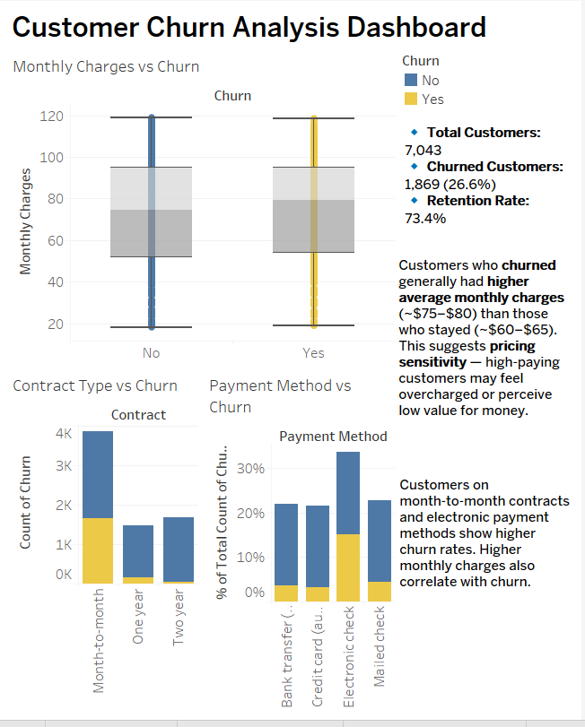

# Customer Churn Analysis — Tableau Project

This project explores customer churn behavior in a telecom company using a public Kaggle dataset.  
The goal is to identify key factors influencing customer churn and provide insights for improving retention.

## 🔧 Tools Used
- **Excel / Google Sheets** → Data inspection
- **R **Studio****→ Data Cleaning
- **Tableau Public** → Dashboard creation and visualization  

## 📊 Key Insights
- Customers with **higher monthly charges** and **shorter tenure** are more likely to churn.  
- **Month-to-month contracts** and **electronic check payments** show the **highest churn rates**.  
- **Automatic payments** and **long-term contracts** significantly reduce churn.  
- Customers with **tenure > 2 years** have a **very low churn rate**.

## 📈 Dashboard Preview

🔗 **[View the Interactive Dashboard on Tableau Public](https://public.tableau.com/app/profile/arisha.naseem/viz/CustomerChurnAnalysisDashboard_17617368020950/CustomerChurnAnalysisDashboard)**

## 📁 Dataset
[Kaggle — Telco Customer Churn Dataset](https://www.kaggle.com/blastchar/telco-customer-churn)

## 💡 Business Recommendations
- Incentivize **long-term contracts** through discounts.  
- Encourage customers to switch to **automatic payments**.  
- Focus on **early-stage customers** (tenure < 12 months) with retention programs.  
- Provide **personalized offers** for high-bill customers to improve satisfaction.

---

*Created by Arisha Naseem | Tools: Tableau, Excel | October 2025*

